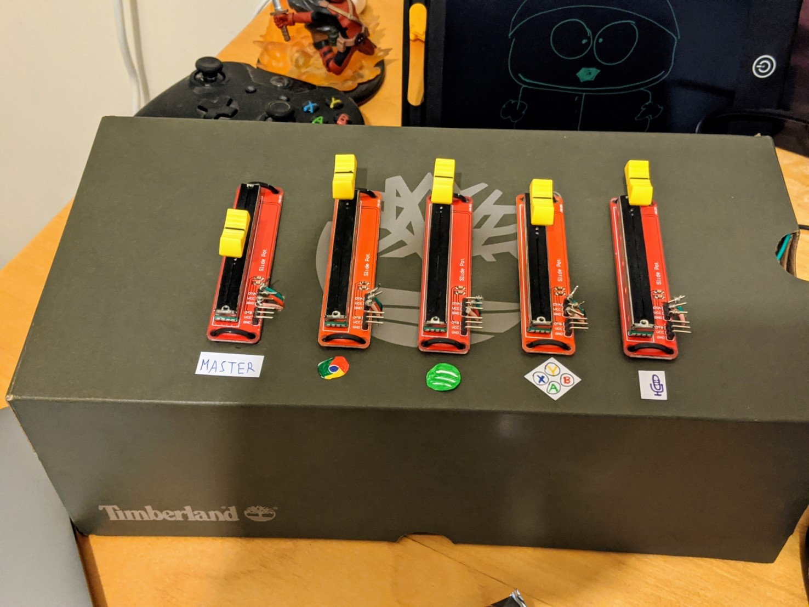
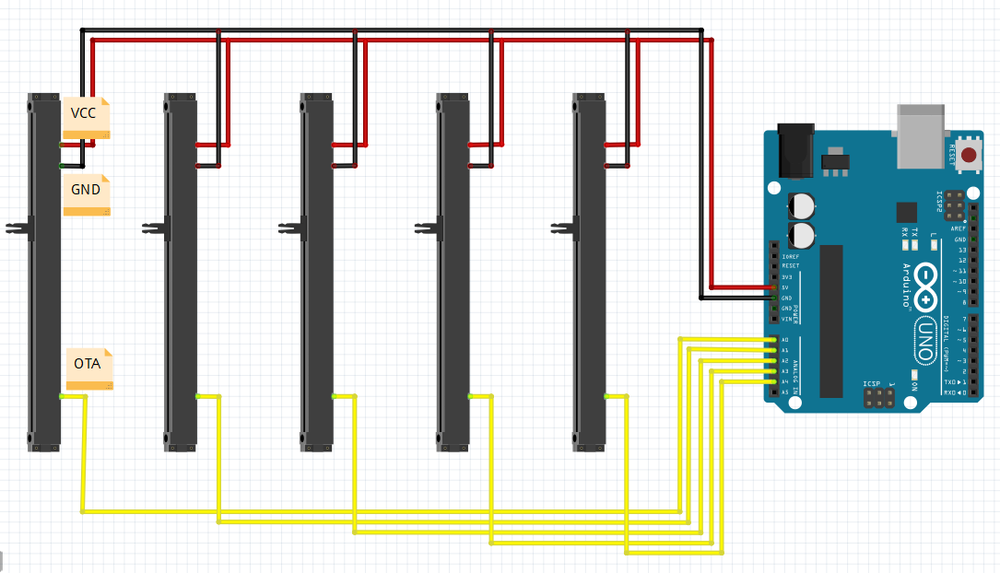

# deej

deej is an **open-source hardware volume mixer** for Windows and Linux PCs. It lets you use real-life sliders (like a DJ!) to **seamlessly control the volumes of different apps** (such as your music player, the game you're playing and your voice chat session) without having to stop what you're doing.

**Join the [deej Discord server](https://discord.gg/nf88NJu) if you need help or have any questions!**

[](https://discord.gg/nf88NJu)

deej consists of a [lightweight desktop client](#features) written in Go, and an Arduino-based hardware setup that's simple and cheap to build. [**Check out some versions built by members of our community!**](./community.md)

**[Download the latest release](https://github.com/omriharel/deej/releases/latest) | [Video demonstration](https://youtu.be/VoByJ4USMr8) | [Build video by Tech Always](https://youtu.be/x2yXbFiiAeI)**




## Table of contents

- [Features](#features)
- [How it works](#how-it-works)
  - [Hardware](#hardware)
    - [Schematic](#schematic)
  - [Software](#software)
- [Slider mapping (configuration)](#slider-mapping-configuration)
- [Build your own!](#build-your-own)
  - [Build video](#build-video)
  - [Bill of Materials](#bill-of-materials)
  - [Thingiverse collection](#thingiverse-collection)
  - [Build procedure](#build-procedure)
- [How to run](#how-to-run)
  - [Requirements](#requirements)
  - [Download and installation](#download-and-installation)
  - [Building from source](#building-from-source)
- [Community](#community)
- [Long-ish term roadmap](#long-ish-term-roadmap)
- [License](#license)

## Features

deej is written in Go and [distributed](https://github.com/omriharel/deej/releases/latest) as a portable (no installer needed) executable.

- Bind apps to different sliders
  - Bind multiple apps per slider (i.e. one slider for all your games)
  - Bind the master channel
  - Bind "system sounds" (on Windows)
  - **_New:_** Bind specific audio devices by name (on Windows, _experimental_)
- Control your microphone's input level
- Lightweight desktop client, consuming around 10MB of memory
- Runs from your system tray
- Helpful notifications to let you know if something isn't working

> **Looking for the older Python version?** It's no longer maintained, but you can always find it in the [`legacy-python` branch](https://github.com/omriharel/deej/tree/legacy-python).

## How it works

### Hardware

- The sliders are connected to 5 (or as many as you like) analog pins on an Arduino Nano/Uno board. They're powered from the board's 5V output (see schematic)
- The board connects via a USB cable to the PC

#### Schematic



### Software

- The code running on the Arduino board is a [C program](./arduino/deej-5-sliders-vanilla/deej-5-sliders-vanilla.ino) constantly writing current slider values over its serial interface
- The PC runs a lightweight Go client [`cmd/main.go`](./cmd/main.go) in the background. This client reads the serial stream and adjusts app volumes according to the given configuration file

## Slider mapping (configuration)

`deej` uses a simple YAML-formatted configuration file named [`config.yaml`](./config.yaml), placed alongside the deej executable.

The config file determines which applications (and devices) are mapped to which sliders, and which parameters to use for the connection to the Arduino board, as well as other user preferences.

**This file auto-reloads when its contents are changed, so you can change application mappings on-the-fly without restarting `deej`.**

It looks like this:

```yaml
slider_mapping:
  0: master
  1: chrome.exe
  2: spotify.exe
  3:
    - pathofexile_x64.exe
    - rocketleague.exe
  4: discord.exe

# set this to true if you want the controls inverted (i.e. top is 0%, bottom is 100%)
invert_sliders: false

# settings for connecting to the arduino board
com_port: COM4
baud_rate: 9600

# limits how often deej will look for new processes
process_refresh_frequency: 5
```

- `master` is a special option to control the master volume of the system _(uses the default playback device)_
- `mic` is a special option to control your microphone's input level _(uses the default recording device)_.
- On Windows, you can specify a device's full name, i.e. `Speakers (Realtek High Definition Audio)`, to bind that device's level to a slider. This doesn't conflict with the default `master` and `mic` options, and works for both input and output devices.
  - Be sure to use the full device name, as seen in the menu that comes up when left-clicking the speaker icon in the tray menu
- `system` is a special option on Windows to control the "System sounds" volume in the Windows mixer
- All names are case-**in**sensitive, meaning both `chrome.exe` and `CHROME.exe` will work
- You can create groups of process names (using a list) to either:
    - control more than one app with a single slider
    - choose whichever process in the group that's currently running (i.e. to have one slider control any game you're playing)

## Build your own!

Building `deej` is very simple. You only need a few relatively cheap parts - it's an excellent starter project (and my first Arduino project, personally). Remember that if you need any help or have a question that's not answered here, you can always [join the deej Discord server](https://discord.gg/nf88NJu).

Build `deej` for yourself, or as an awesome gift for your gaming buddies!

### Build video

In case you prefer watching to reading, Charles from the [**Tech Always**](https://www.youtube.com/c/TechAlways) YouTube channel has made [**a fantastic video**](https://youtu.be/x2yXbFiiAeI) that covers the basics of building deej for yourself, including parts, costs, assembly and software. I highly recommend checking it out!

### Bill of Materials

- An Arduino Nano, Pro Micro or Uno board
  - I officially recommend using a Nano or a Pro Micro for their smaller form-factor, friendlier USB connectors and more analog pins. Plus they're cheaper
  - You can also use any other development board that has a Serial over USB interface
- A few slider potentiometers, up to your number of free analog pins (the cheaper ones cost around 1-2 USD each, and come with a standard 10K Ohm variable resistor. These _should_ work just fine for this project)
  - **Important:** make sure to get **linear** sliders, not logarithmic ones! Check the product description
  - You can also use circular knobs if you like
- Some wires
- Any kind of box to hold everything together. **You don't need a 3D printer for this project!** It works fantastically with just a piece of cardboard or a shoebox. That being said, if you do have one, read on...

### Thingiverse collection

With many different 3D-printed designs being added to our [community showcase](./community.md), it felt right to gather all of them in a Thingiverse collection for you to browse. If you have access to a 3D printer, feel free to use one of the designs in your build.

**[Visit our community-created design collection on Thingiverse!](https://thingiverse.com/omriharel/collections/deej)**

> You can also [submit your own](https://discord.gg/nf88NJu) design to be added to the collection. Regardless, if you do upload your design to Thingiverse, _please add a `deej` tag to it so that others can find it more easily_.


### Build procedure

- Connect everything according to the [schematic](#schematic)
- Test with a multimeter to be sure your sliders are hooked up correctly
- Flash the Arduino chip with the sketch in [`arduino\deej-5-sliders-vanilla`](./arduino/deej-5-sliders-vanilla/deej-5-sliders-vanilla.ino)
  - _Important:_ If you have more or less than 5 sliders, you must edit the sketch to match what you have
- After flashing, check the serial monitor. You should see a constant stream of values separated by a pipe (`|`) character, e.g. `0|240|1023|0|483`
  - When you move a slider, its corresponding value should move between 0 and 1023
- Congratulations, you're now ready to run the `deej` executable!

## How to run

### Requirements

#### Windows

- Windows. That's it

#### Linux

- Install `libgtk-3-dev`, `libappindicator3-dev` and `libwebkit2gtk-4.0-dev` for system tray support

### Download and installation

- Head over to the [releases page](https://github.com/omriharel/deej/releases) and download the [latest version](https://github.com/omriharel/deej/releases/latest)'s executable and configuration file (`deej.exe` and `config.yaml`)
- Place them in the same directory anywhere on your machine
- (Optional, on Windows) Create a shortcut to `deej.exe` and copy it to `%APPDATA%\Microsoft\Windows\Start Menu\Programs\Startup` to have `deej` run on boot

### Building from source

If you'd rather not download a compiled executable, or want to extend `deej` or modify it to your needs, feel free to clone the repository and build it yourself. All you need is a Go 1.14 (or above) environment on your machine. If you go this route, make sure to check out the [developer scripts](./scripts).

Like other Go packages, you can also use the `go get` tool: `go get -u github.com/omriharel/deej`.

If you need any help with this, please [join our Discord server](https://discord.gg/nf88NJu).

## Community

[](https://discord.gg/nf88NJu)

While `deej` is still a very new project, a vibrant community has already started to grow around it. Come hang out with us in the [deej Discord server](https://discord.gg/nf88NJu), or check out awesome builds made by our members in the [community showcase](./community.md).

The server is also a great place to ask questions, suggest features or report bugs (but of course, feel free to use GitHub if you prefer).

## Long-ish term roadmap

- Serial communications rework to support two-way data flows for better extensibility
- Basic GUI to replace manual configuration editing
- Feel free to open an issue if you feel like something else is missing

## License

`deej` is released under the [MIT license](./LICENSE).
